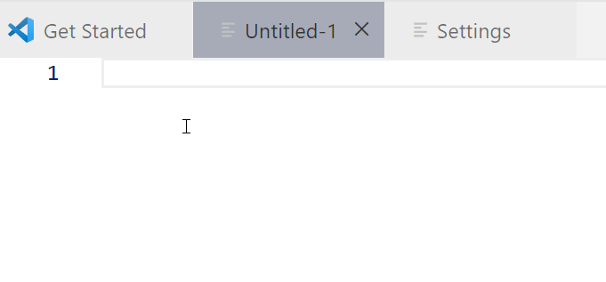
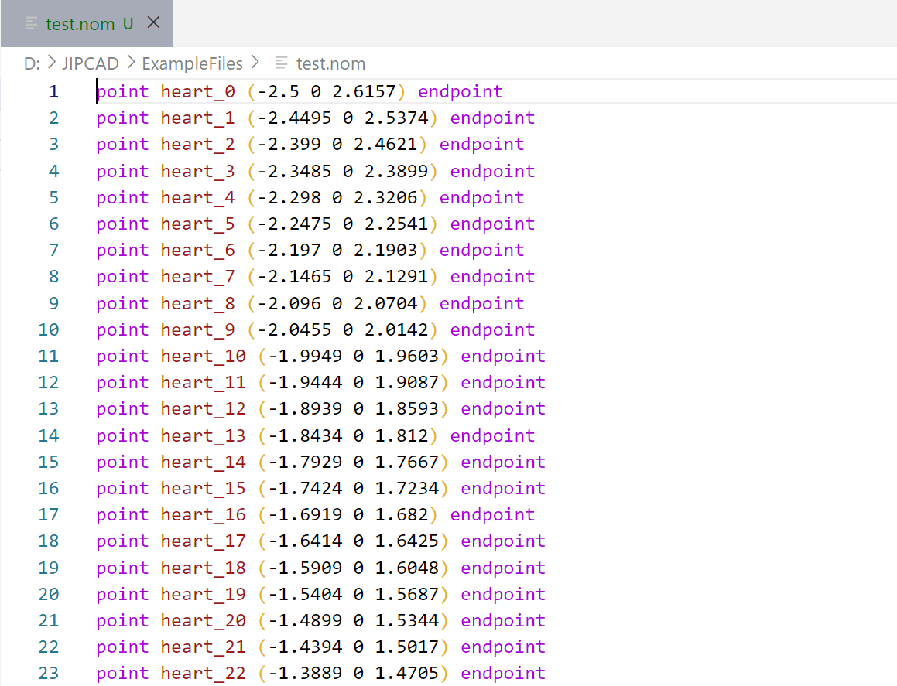
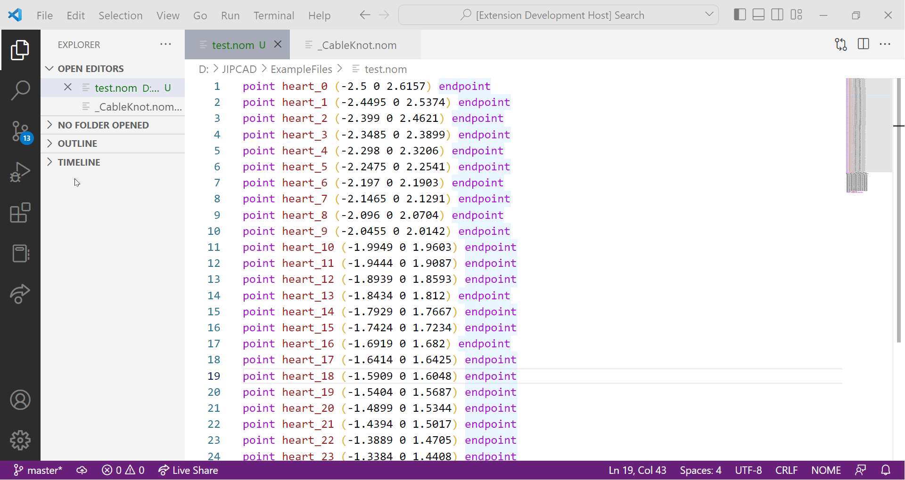
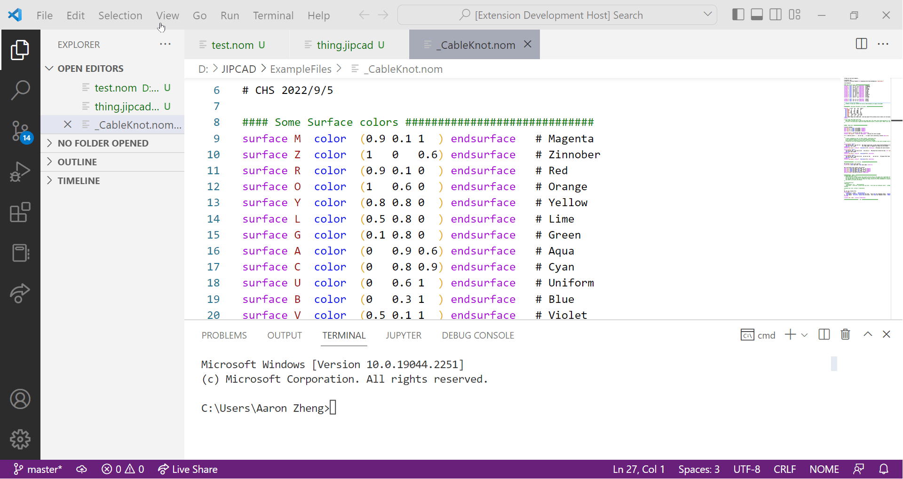
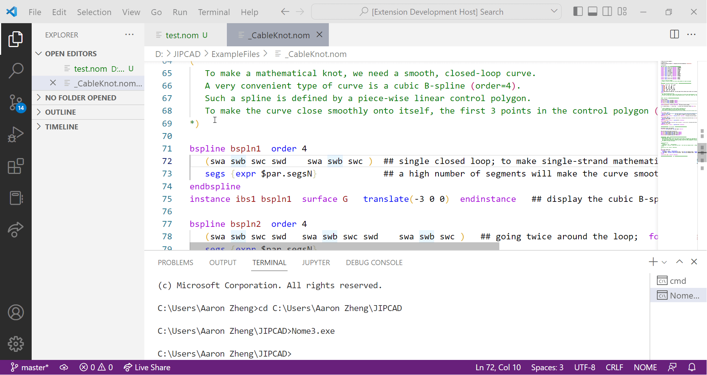

# NOME3 Language Extension README

This is a [Visual Studio Code](https://code.visualstudio.com/) extension for the NOME3 language used for **3D-computer-aided-design** on the **[JIPCAD](https://jipcad.github.io/docs/)** software, supervised by Prof. Carlo Sequin and developed by the JIPCAD group.

This extension supports files with both the (.nom, .jipcad $*$) endings.
Enjoy!

## Features
### 1. Autocompletion of commands


### 2. Syntax coloring


### 3. Commenting


### 4. Running of Nome Executable


### 5. Customize directory of NOME executable



## Intended Updates/Improvements

- [ ]  Semantic highlighting
- [ ]  Syntax error reporting


## Development


```bash
$ git clone https://github.com/JIPCAD/JIPCAD-vs-code
$ npm ci
```

Pressing `F5` will compile and run the extension in a new 'Extension Development Host' window.
